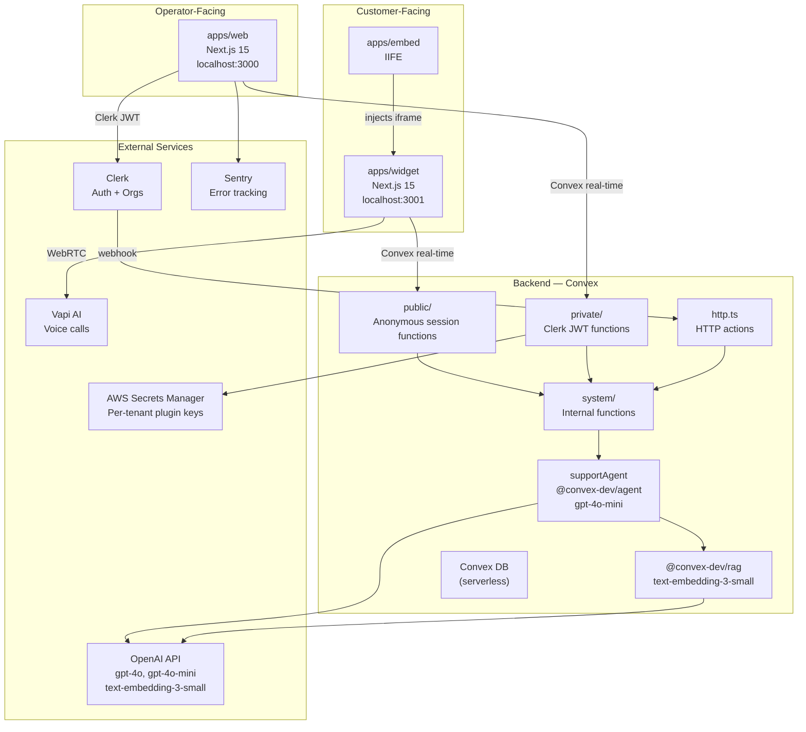
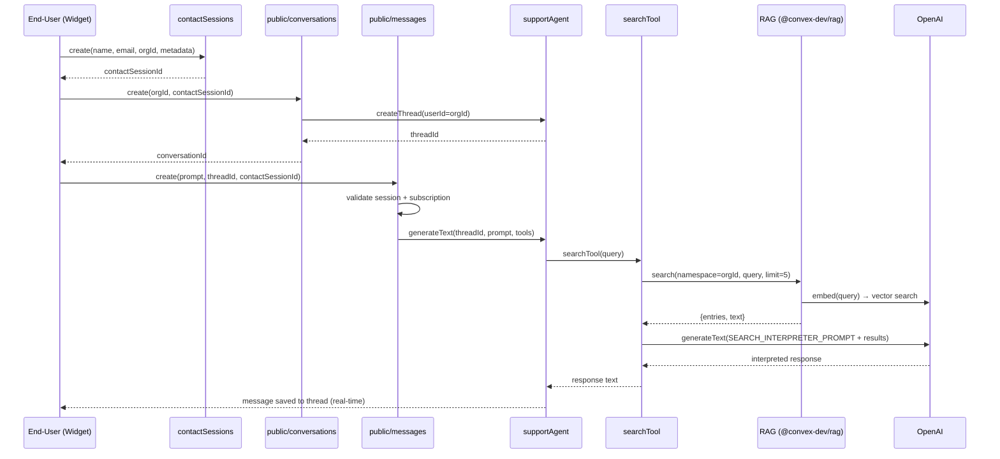
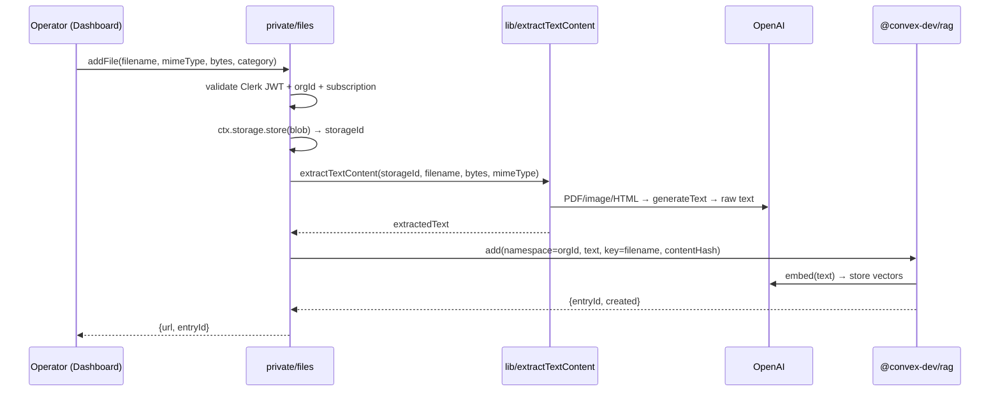
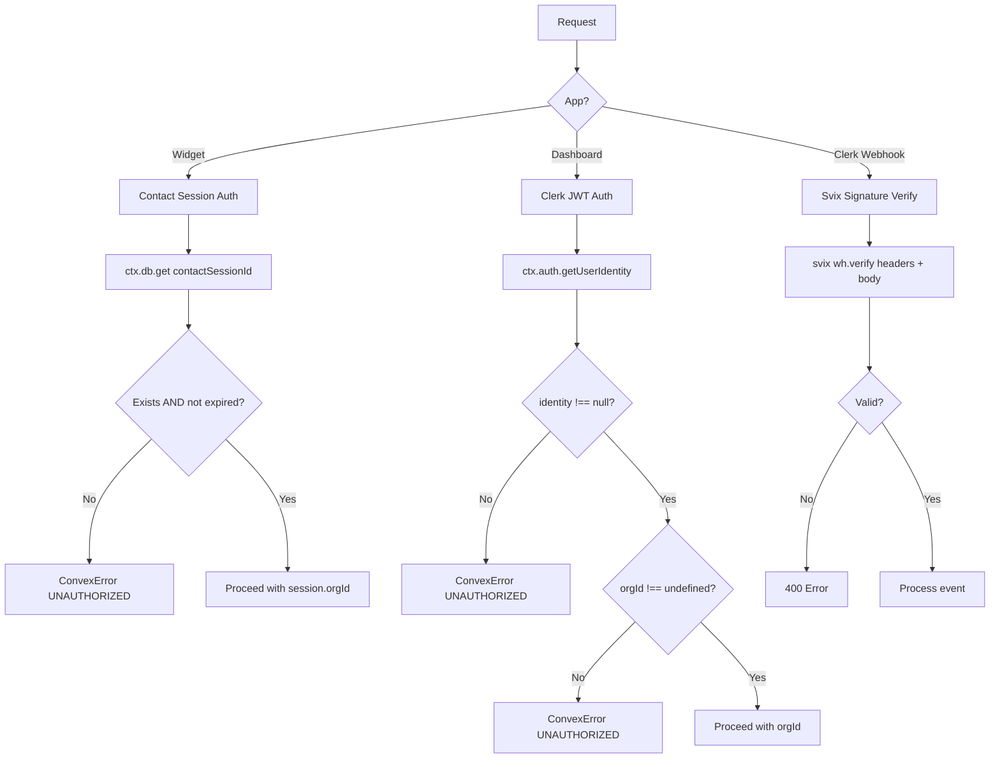

# Aivon — AI Customer Support Platform

> An AI-powered customer support platform with a chat widget, dashboard for agents, and an embeddable script — all in a single Turborepo monorepo.

---

## Table of Contents

- [Project Description](#project-description)
- [Tech Stack](#tech-stack)
- [Prerequisites](#prerequisites)
- [Installation](#installation)
- [Environment Variables](#environment-variables)
- [How to Run](#how-to-run)
- [Project Structure](#project-structure)
- [API Endpoints](#api-endpoints)
- [Build & Deployment](#build--deployment)

---

## Project Description

Aivon is a full-stack, multi-tenant AI customer support platform. It allows businesses (organisations) to deploy an embeddable chat widget on their website that connects end-users to a RAG-powered AI support agent. The agent searches a per-organisation knowledge base to answer questions, can escalate conversations to human agents, and marks conversations as resolved — all in real time. Operators manage conversations, upload knowledge-base files, configure the widget, and integrate with third-party services (e.g. Vapi for voice) through a dedicated web dashboard.

---

## Tech Stack

| Category | Technology |
|---|---|
| **Monorepo Tooling** | [Turborepo](https://turbo.build/) v2, [pnpm](https://pnpm.io/) v10 Workspaces |
| **Frontend — Dashboard** | [Next.js](https://nextjs.org/) v15 (App Router), React v19, TypeScript 5.7 |
| **Frontend — Widget** | Next.js v15 (Turbopack), React v19, TypeScript 5.7 |
| **Frontend — Embed Script** | Vanilla TypeScript, [Vite](https://vitejs.dev/) v5 |
| **UI Components** | Shared `@workspace/ui` package (Radix-based, shadcn/ui conventions) |
| **State Management** | [Jotai](https://jotai.org/) v2 |
| **Forms** | React Hook Form v7 + Zod v3 |
| **Authentication** | [Clerk](https://clerk.com/) (multi-org, `@clerk/nextjs` v6) |
| **Backend / Database** | [Convex](https://convex.dev/) v1.25 (real-time serverless DB + functions) |
| **AI / LLM** | [Vercel AI SDK](https://sdk.vercel.ai/) v4, `@convex-dev/agent` v0.1, OpenAI models |
| **RAG** | `@convex-dev/rag` v0.3 (vector search over uploaded knowledge-base files) |
| **Voice Integration** | [Vapi AI](https://vapi.ai/) — `@vapi-ai/web` (client), `@vapi-ai/server-sdk` (backend) |
| **Secrets Management** | AWS Secrets Manager (`@aws-sdk/client-secrets-manager`) |
| **Webhook Validation** | [Svix](https://svix.com/) |
| **Error Monitoring** | [Sentry](https://sentry.io/) (`@sentry/nextjs` v9) |
| **Styling** | Tailwind CSS v4 (via PostCSS, shared through `@workspace/ui`) |
| **Linting / Formatting** | ESLint v9, Prettier v3 (shared via `@workspace/eslint-config`) |

---

## Prerequisites

| Requirement | Version |
|---|---|
| **Node.js** | `>= 20` |
| **pnpm** | `10.4.1` (set as `packageManager`) |
| **Convex account** | [convex.dev](https://convex.dev) |
| **Clerk account** | [clerk.com](https://clerk.com) |
| **OpenAI API key** | [platform.openai.com](https://platform.openai.com) |
| **AWS account** | Required for Secrets Manager (Vapi key storage) |
| **Vapi account** _(optional)_ | [vapi.ai](https://vapi.ai) — for voice support integration |
| **Sentry account** _(optional)_ | [sentry.io](https://sentry.io) — for error monitoring |

---

## Installation

```bash
# 1. Clone the repository
git clone https://github.com/Yashgiradkar/Aivon.git
cd Aivon

# 2. Install all workspace dependencies
pnpm install

# 3. Bootstrap the Convex backend (first-time setup)
cd packages/backend
pnpm run setup   # runs: convex dev --until-success
```

---

## Environment Variables

Create the following `.env.local` files before running any app.

### `packages/backend/.env.local`

| Variable | Description |
|---|---|
| `CONVEX_DEPLOYMENT` | Your Convex deployment slug (e.g. `dev:your-slug`) |
| `CONVEX_URL` | Your Convex cloud URL |
| `CONVEX_SITE_URL` | Your Convex HTTP actions site URL |
| `CLERK_JWT_ISSUER_DOMAIN` | Clerk JWT issuer URL for token verification |
| `CLERK_SECRET_KEY` | Clerk backend secret key |
| `CLERK_WEBHOOK_SECRET` | Svix webhook secret for Clerk events |
| `OPENAI_API_KEY` | OpenAI API key for the AI support agent |
| `AWS_ACCESS_KEY_ID` | AWS credentials for Secrets Manager |
| `AWS_SECRET_ACCESS_KEY` | AWS credentials for Secrets Manager |
| `AWS_REGION` | AWS region (e.g. `us-east-1`) |

### `apps/web/.env.local`

| Variable | Description |
|---|---|
| `NEXT_PUBLIC_CONVEX_URL` | Public Convex URL for the dashboard frontend |
| `NEXT_PUBLIC_CLERK_PUBLISHABLE_KEY` | Clerk publishable key |
| `NEXT_PUBLIC_CLERK_FRONTEND_API_URL` | Clerk frontend API URL |
| `CLERK_SECRET_KEY` | Clerk secret key (server-side usage) |
| `NEXT_PUBLIC_CLERK_SIGNIN_URL` | Sign-in page path (e.g. `/sign-in`) |
| `NEXT_PUBLIC_CLERK_SIGNUP_URL` | Sign-up page path (e.g. `/sign-up`) |
| `NEXT_PUBLIC_CLERK_SIGNIN_FALLBACK_REDIRECT_URL` | Post-sign-in redirect |
| `NEXT_PUBLIC_CLERK_SIGNUP_FALLBACK_REDIRECT_URL` | Post-sign-up redirect |
| `SENTRY_AUTH_TOKEN` | Sentry auth token for source map uploads |

### `apps/widget/.env.local`

| Variable | Description |
|---|---|
| `NEXT_PUBLIC_CONVEX_URL` | Public Convex URL for the widget frontend |

> **Note:** Never commit `.env.local` files. They are already listed in `.gitignore`.

---

## How to Run

### Development (all apps in parallel)

From the **repository root**:

```bash
pnpm dev
```

This uses Turborepo to start all packages concurrently:

| App | URL | Command |
|---|---|---|
| `apps/web` (Dashboard) | `http://localhost:3000` | `next dev --port 3000` |
| `apps/widget` (Chat Widget) | `http://localhost:3001` | `next dev --turbopack --port 3001` |
| `apps/embed` (Embed Script) | `http://localhost:3002` | `vite --port 3002` |
| `packages/backend` (Convex) | Convex Cloud | `convex dev` |

### Running a single app

```bash
# Dashboard only
cd apps/web && pnpm dev

# Widget only
cd apps/widget && pnpm dev

# Embed script only
cd apps/embed && pnpm dev

# Convex backend only
cd packages/backend && pnpm dev
```

### Embedding the widget on a website

After building the embed script, include it on any page with:

```html
<script
  src="https://your-domain.com/embed.js"
  data-organization-id="YOUR_ORG_ID"
  data-position="bottom-right"
  defer
></script>
```

The script exposes a global `EchoWidget` API for programmatic control:

```js
EchoWidget.show();
EchoWidget.hide();
EchoWidget.destroy();
EchoWidget.init({ organizationId: 'org_xxx', position: 'bottom-left' });
```

---

## Project Structure

```
Aivon/
├── apps/
│   ├── web/                  # Operator dashboard (Next.js 15, App Router)
│   │   ├── app/
│   │   │   ├── (auth)/       # Sign-in / Sign-up pages
│   │   │   └── (dashboard)/  # Protected dashboard routes
│   │   │       ├── conversations/   # Conversation inbox & detail view
│   │   │       ├── customization/   # Widget appearance settings
│   │   │       ├── files/           # Knowledge-base file uploads
│   │   │       ├── integrations/    # Third-party integrations
│   │   │       ├── plugins/         # Plugin management (e.g. Vapi)
│   │   │       └── billing/         # Subscription & billing
│   │   ├── components/       # Shared dashboard UI components
│   │   ├── modules/          # Feature modules (auth, dashboard, files, …)
│   │   ├── hooks/            # Custom React hooks
│   │   ├── lib/              # Utility functions
│   │   └── middleware.ts     # Clerk auth & org-redirect middleware
│   │
│   ├── widget/               # End-user chat widget (Next.js 15)
│   │   ├── app/              # Widget page & layout
│   │   ├── components/       # Widget-specific UI components
│   │   ├── modules/widget/   # Widget business logic
│   │   ├── hooks/            # Widget hooks
│   │   └── lib/              # Widget utilities
│   │
│   └── embed/                # Lightweight embeddable script (Vite + TS)
│       ├── embed.ts          # Self-contained IIFE embed script
│       ├── config.ts         # Widget URL & defaults
│       ├── icons.ts          # Inline SVG icons
│       └── demo.html         # Local embed demo page
│
├── packages/
│   ├── backend/              # Convex backend (DB, AI, HTTP actions)
│   │   └── convex/
│   │       ├── schema.ts             # Database schema
│   │       ├── convex.config.ts      # Agent + RAG plugins config
│   │       ├── http.ts               # HTTP actions (Clerk webhook)
│   │       ├── auth.config.ts        # Clerk JWT auth config
│   │       ├── public/               # Public Convex functions (widget-facing)
│   │       ├── private/              # Private Convex functions (dashboard-facing)
│   │       └── system/
│   │           ├── ai/
│   │           │   ├── agents/       # AI support agent definition
│   │           │   ├── tools/        # Agent tools (search, escalate, resolve)
│   │           │   └── constants.ts  # LLM system prompts
│   │           └── subscriptions.ts  # Subscription mutation
│   │
│   ├── ui/                   # Shared Radix/shadcn UI component library
│   ├── eslint-config/        # Shared ESLint configurations
│   ├── typescript-config/    # Shared tsconfig bases
│   └── math/                 # Shared math utilities
│
├── turbo.json                # Turborepo pipeline config
├── pnpm-workspace.yaml       # pnpm workspace definition
└── package.json              # Root scripts & devDependencies
```

---


## Module Responsibilities

| Module | Responsibility |
|---|---|
| `convex/public/contactSessions.ts` | Create + validate anonymous user sessions (24h TTL) |
| `convex/public/conversations.ts` | Create conversation + agent thread; list/get for widget |
| `convex/public/messages.ts` | Submit user message → trigger agent or save only |
| `convex/private/messages.ts` | Operator reply + `enhanceResponse` AI action |
| `convex/private/conversations.ts` | Operator conversation list/detail + status management |
| `convex/private/files.ts` | Upload → extract text → RAG index |
| `convex/private/vapi.ts` | List Vapi assistants/phone numbers via server SDK |
| `convex/private/widgetSettings.ts` | Upsert/get widget greeting + suggestions + Vapi config |
| `convex/private/plugins.ts` | CRUD for org plugin registrations |
| `convex/private/secrets.ts` | Trigger async AWS SM secret upsert |
| `convex/system/ai/agents/supportAgent.ts` | Agent singleton (model + instructions) |
| `convex/system/ai/tools/search.ts` | RAG search + second LLM interpreter pass |
| `convex/system/ai/tools/escalateConversation.ts` | Set status → escalated |
| `convex/system/ai/tools/resolveConversation.ts` | Set status → resolved |
| `convex/system/ai/constants.ts` | All LLM system prompts — edit prompts HERE ONLY |
| `convex/system/ai/rag.ts` | RAG singleton (text-embedding-3-small, 1536 dim) |
| `convex/lib/extractTextContent.ts` | Multi-modal extraction: image/PDF/HTML/text |
| `convex/lib/secrets.ts` | AWS Secrets Manager CRUD helpers |
| `convex/system/subscriptions.ts` | Upsert/get org subscription status |
| `convex/system/conversations.ts` | Internal escalate/resolve + getByThreadId |
| `convex/system/contactSessions.ts` | Internal session refresh + getOne |
| `convex/system/plugins.ts` | Internal plugin upsert/get |
| `convex/system/secrets.ts` | Internal AWS SM write + plugin registration |
| `convex/http.ts` | HTTP router — Clerk `subscription.updated` webhook |
| `convex/schema.ts` | DB schema (single source of truth) |
| `convex/playground.ts` | `@convex-dev/agent-playground` API exposure |
| `apps/embed/embed.ts` | IIFE — injects button + iframe; reads `data-organization-id` |
| `apps/embed/config.ts` | `EMBED_CONFIG.WIDGET_URL` and `DEFAULT_POSITION` |
| `apps/widget/modules/widget/hooks/use-vapi.ts` | Vapi WebRTC voice call hook |

---


## System Overview

Aivon is a three-tier, multi-tenant SaaS product built on a serverless stack. All persistence and business logic live in **Convex**; authentication and multi-org management live in **Clerk**; AI capabilities use **OpenAI** (LLM + embeddings) via the **Vercel AI SDK**; external plugin secrets live in **AWS Secrets Manager**.



---

## Application Boundaries

| App | Port | Auth | Audience | Entry |
|---|---|---|---|---|
| `apps/web` | 3000 | Clerk JWT (operators) | Support team | `app/(dashboard)/` |
| `apps/widget` | 3001 | Contact session (anon) | End-users | `app/page.tsx` |
| `apps/embed` | 3002 | None (script) | Any website | `embed.ts` IIFE |
| `packages/backend` | Cloud | Convex auth | Both | `convex/` |

---

## Data Flow

### Widget User Sends a Message



### Operator Uploads a Knowledge Base File



---

## Authentication & Authorization Flow



### Auth Layers

| Layer | Mechanism | Where |
|---|---|---|
| Operator auth | Clerk JWT (multi-org) | `apps/web` + `middleware.ts` |
| Convex auth | Clerk JWT → Convex provider | `convex/auth.config.ts` |
| End-user auth | Contact session (24h TTL, auto-refresh at <4h) | `convex/public/contactSessions.ts` |
| Webhook auth | Svix signature verification | `convex/http.ts` |
| Plugin secrets | AWS Secrets Manager (no client access) | `convex/lib/secrets.ts` |

---


### Conversation Status FSM

```
unresolved ──(agent search/escalate)──► escalated
unresolved ──(agent resolve)──────────► resolved
unresolved ──(operator reply)─────────► escalated (auto)
escalated  ──(operator updateStatus)──► resolved
```
Once `resolved`: all new message attempts throw `ConvexError BAD_REQUEST`.

---

## AI Architecture

### Agent

- **Framework:** `@convex-dev/agent` v0.1.16
- **Model:** `gpt-4o-mini` (chat)
- **Instructions:** `SUPPORT_AGENT_PROMPT` from `convex/system/ai/constants.ts`
- **Tools:** `searchTool`, `escalateConversationTool`, `resolveConversationTool`
- **Thread persistence:** Full conversation history stored per `threadId`
- **Playground:** `convex/playground.ts` exposes `@convex-dev/agent-playground` API

### RAG Pipeline

- **Embedding model:** `text-embedding-3-small` (OpenAI, 1536 dimensions)
- **Framework:** `@convex-dev/rag` v0.3.3
- **Namespacing:** Per-org (`namespace = orgId`) — no cross-tenant leakage
- **Search:** `rag.search(namespace, query, limit: 5)` — pure vector similarity
- **Ingestion:** `rag.add(namespace, text, key, title, metadata, contentHash)`
- **Idempotency:** `contentHash` prevents re-indexing unchanged files

---


## External Integrations

| Service | Role | Integration Point |
|---|---|---|
| **Clerk** | Auth, multi-org, subscription webhooks | `apps/web/middleware.ts`, `convex/auth.config.ts`, `convex/http.ts` |
| **OpenAI** | LLM inference + embeddings | `@ai-sdk/openai` throughout `convex/system/ai/` |
| **Convex** | Serverless DB + functions + real-time | All `packages/backend/convex/` |
| **AWS Secrets Manager** | Per-tenant third-party API keys | `convex/lib/secrets.ts` |
| **Vapi AI** | Voice call channel | `@vapi-ai/server-sdk` (backend), `@vapi-ai/web` (widget) |
| **Sentry** | Error monitoring (web dashboard) | `apps/web/sentry.*.config.ts`, `instrumentation.ts` |
| **Svix** | Clerk webhook signature verification | `convex/http.ts` |

---

## Async / Background Processing

| Mechanism | Where Used |
|---|---|
| Convex `action` | All LLM calls (`public/messages.ts`, `private/messages.ts`, `private/files.ts`) — non-blocking from DB |
| `ctx.scheduler.runAfter(0, ...)` | Secret upsert in `private/secrets.ts` — fires async internal action |
| Real-time subscriptions | Convex queries are reactive — widget and dashboard auto-update on DB changes |

---


## Environment Variables

### `packages/backend/.env.local`

```env
CONVEX_DEPLOYMENT=dev:<your-deployment-slug>
CONVEX_URL=https://<your-deployment-slug>.convex.cloud
CONVEX_SITE_URL=https://<your-deployment-slug>.convex.site
CLERK_JWT_ISSUER_DOMAIN=https://<your-clerk-instance>.clerk.accounts.dev
CLERK_SECRET_KEY=sk_test_...
CLERK_WEBHOOK_SECRET=whsec_...
OPENAI_API_KEY=sk-...
AWS_ACCESS_KEY_ID=...
AWS_SECRET_ACCESS_KEY=...
AWS_REGION=us-east-1
```

### `apps/web/.env.local`

```env
NEXT_PUBLIC_CONVEX_URL=https://<your-deployment-slug>.convex.cloud
NEXT_PUBLIC_CLERK_PUBLISHABLE_KEY=pk_test_...
NEXT_PUBLIC_CLERK_FRONTEND_API_URL=https://<your-clerk-instance>.clerk.accounts.dev
CLERK_SECRET_KEY=sk_test_...
NEXT_PUBLIC_CLERK_SIGNIN_URL=/sign-in
NEXT_PUBLIC_CLERK_SIGNUP_URL=/sign-up
NEXT_PUBLIC_CLERK_SIGNIN_FALLBACK_REDIRECT_URL=/
NEXT_PUBLIC_CLERK_SIGNUP_FALLBACK_REDIRECT_URL=/
SENTRY_AUTH_TOKEN=sntrys_...     # optional, for error monitoring
```

### `apps/widget/.env.local`

```env
NEXT_PUBLIC_CONVEX_URL=https://<your-deployment-slug>.convex.cloud
```

### `apps/embed` (build-time only)

Set `VITE_WIDGET_URL` before running `vite build` to point to your deployed widget URL.
Default fallback: `http://localhost:3001` (from `apps/embed/config.ts`).

---


## Development Commands

### Run Everything

```bash
# From repo root — starts all 4 processes via Turborepo
pnpm dev
```

| Process | Port | Command |
|---|---|---|
| `apps/web` dashboard | 3000 | `next dev --port 3000` |
| `apps/widget` widget | 3001 | `next dev --turbopack --port 3001` |
| `apps/embed` script | 3002 | `vite --port 3002` |
| `packages/backend` | Convex cloud | `convex dev` |

### Run Individual Apps

```bash
cd apps/web    && pnpm dev
cd apps/widget && pnpm dev
cd apps/embed  && pnpm dev
cd packages/backend && pnpm dev
```

### Build

```bash
pnpm build          # from repo root — builds all apps in dependency order
cd apps/embed && pnpm build   # outputs dist/widget.iife.js
```


## Code Organization

### Backend (`packages/backend/convex/`)

```
convex/
├── public/          # Widget-facing: anonymous session auth
│   ├── contactSessions.ts
│   ├── conversations.ts
│   ├── messages.ts
│   ├── organizations.ts
│   ├── secrets.ts
│   └── widgetSettings.ts
├── private/         # Dashboard-facing: Clerk JWT auth
│   ├── contactSessions.ts
│   ├── conversations.ts
│   ├── files.ts
│   ├── messages.ts
│   ├── plugins.ts
│   ├── secrets.ts
│   ├── vapi.ts
│   └── widgetSettings.ts
├── system/          # Internal (no direct client access)
│   ├── ai/
│   │   ├── agents/supportAgent.ts
│   │   ├── tools/
│   │   │   ├── escalateConversation.ts
│   │   │   ├── resolveConversation.ts
│   │   │   └── search.ts
│   │   ├── constants.ts
│   │   └── rag.ts
│   ├── contactSessions.ts
│   ├── conversations.ts
│   ├── plugins.ts
│   ├── secrets.ts
│   └── subscriptions.ts
├── lib/
│   ├── extractTextContent.ts
│   └── secrets.ts
├── schema.ts
├── auth.config.ts
├── constants.ts
├── convex.config.ts
├── http.ts
├── playground.ts
└── users.ts
```

### Dashboard App (`apps/web/`)

```
apps/web/
├── app/
│   ├── (auth)/             # Public auth routes
│   │   ├── sign-in/
│   │   └── sign-up/
│   └── (dashboard)/        # Protected routes
│       ├── billing/
│       ├── conversations/
│       │   └── [conversationId]/
│       ├── customization/
│       ├── files/
│       ├── integrations/
│       └── plugins/
├── components/             # Shared components
├── modules/                # Feature modules
│   ├── auth/
│   ├── billing/
│   ├── customization/
│   ├── dashboard/
│   ├── files/
│   ├── integrations/
│   └── plugins/
├── hooks/                  # Shared hooks
├── lib/                    # Utilities
└── middleware.ts           # Clerk auth + org redirect
```

### Widget App (`apps/widget/`)

```
apps/widget/
├── app/
│   ├── layout.tsx
│   └── page.tsx
├── modules/widget/
│   ├── atoms/              # Jotai state atoms
│   ├── hooks/
│   │   └── use-vapi.ts     # Vapi voice integration
│   ├── ui/                 # Widget components
│   ├── components/
│   ├── constants.ts
│   └── types.ts
```

---


## Key Capabilities

| Capability | Details |
|---|---|
| **AI Support Agent** | Tool-using agent (gpt-4o-mini) with autonomous search, escalate, and resolve actions |
| **RAG Knowledge Base** | Per-org vector search; multi-modal ingestion (PDF, images, HTML, text) |
| **Embeddable Widget** | Single `<script>` tag; iframe-based; programmatic API |
| **Real-time Dashboard** | Operator conversation inbox with live updates via Convex |
| **Voice Support** | Vapi AI integration for phone/voice channel in the widget |
| **Multi-tenant** | Per-org data isolation; Clerk multi-org auth; subscription-gated AI |
| **Operator AI Assist** | AI-polishes operator message drafts before sending |

---

## Architecture Overview

```
┌─ Customer Website ───────────────────────┐
│  <script data-organization-id="org_..."> │
│    → injects iframe                      │
│    → apps/widget (Next.js, port 3001)    │
└──────────────────────────────────────────┘
           │ Convex real-time
           ▼
┌─ Convex Backend ─────────────────────────┐
│  public/  ← widget (session auth)        │
│  private/ ← dashboard (Clerk JWT)        │
│  system/  ← AI agent + RAG + internals  │
│    └─ supportAgent (gpt-4o-mini)         │
│         ├─ searchTool (RAG)              │
│         ├─ escalateConversationTool      │
│         └─ resolveConversationTool       │
└──────────────────────────────────────────┘
           │ Convex real-time
           ▼
┌─ Operator Dashboard ─────────────────────┐
│  apps/web (Next.js, port 3000)           │
│  Clerk multi-org auth                    │
└──────────────────────────────────────────┘
```

→ Full architecture: [docs/architecture.md](./docs/architecture.md)

---

## Tech Stack

| Category | Technology |
|---|---|
| **Monorepo** | Turborepo v2, pnpm v10 Workspaces |
| **Dashboard** | Next.js 15 (App Router), React 19, TypeScript 5.7 |
| **Widget** | Next.js 15 (Turbopack), React 19 |
| **Embed Script** | Vanilla TypeScript, Vite v5 |
| **Backend / DB** | Convex v1.25 (serverless, real-time) |
| **AI Agent** | `@convex-dev/agent` v0.1, Vercel AI SDK v4 |
| **LLM** | OpenAI gpt-4o-mini (chat), gpt-4o (extraction) |
| **Embeddings** | OpenAI text-embedding-3-small (1536 dim) |
| **RAG** | `@convex-dev/rag` v0.3 |
| **Auth** | Clerk (multi-org, `@clerk/nextjs` v6) |
| **Voice** | Vapi AI (`@vapi-ai/web`, `@vapi-ai/server-sdk`) |
| **Secrets** | AWS Secrets Manager |
| **Error Monitoring** | Sentry (`@sentry/nextjs` v9) |
| **Styling** | Tailwind CSS v4 (via `@workspace/ui`) |
| **State** | Jotai v2 |
| **Forms** | React Hook Form v7 + Zod v3 |

---

## Main Workflows

### End-User Sends a Support Message
1. Widget loads → creates contact session (name + email)
2. User starts conversation → agent thread created with greeting message
3. User types message → AI agent searches knowledge base, responds, or escalates
4. If no knowledge base match → agent offers human support
5. If human requested → conversation escalated, operator takes over

### Operator Handles a Conversation
1. Signs in to dashboard → sees conversation inbox
2. Filters by status (unresolved / escalated / resolved)
3. Opens conversation → views full message history + contact metadata
4. Replies directly or uses AI Assist to polish message
5. Marks conversation resolved

### Setting Up a Knowledge Base
1. Go to **Files** in dashboard
2. Upload PDF, image, or text documents
3. Files are automatically extracted and indexed into per-org RAG
4. Agent will use these documents to answer user questions

---

### Feature List

* **Convex Backend** — Serverless DB, functions, real-time updates, and end-to-end TypeScript.
* **Public/Private Access Control** — Separate widget and operator functions with session/JWT-based authorization.
* **Multi-Tenant RAG** — Organization-scoped vector search using `orgId` namespaces for strict data isolation.
* **Secure API Key Management** — AWS Secrets Manager stores tenant-specific third-party credentials; only secret references reside in DB.
* **Anonymous Contact Sessions** — 24-hour widget sessions with user identity and browser metadata for conversation tracking.
* **Tool-Using AI Agent** — Stateful support agent with knowledge search, escalation, and resolution tools.
* **Two-Stage LLM Search** — RAG retrieval followed by LLM interpretation for conversational responses.
* **Multi-Modal Knowledge Ingestion** — Model-routed processing for PDFs, images, HTML, and text.
* **Turborepo Monorepo** — Shared packages and coordinated builds across web, widget, and embed applications.
* **Subscription-Gated AI** — AI operations restricted to active subscriptions with Clerk webhook synchronization.


## API Endpoints

The Convex backend exposes one HTTP action endpoint (registered in `http.ts`):

| Method | Path | Description |
|---|---|---|
| `POST` | `/clerk-webhook` | Receives Clerk `subscription.updated` webhook events; updates org membership limits and syncs subscription status in Convex. Validated with Svix. |

All other data operations (conversations, messages, widget settings, files, etc.) are handled via **Convex real-time queries and mutations** called directly from the frontend clients — not via traditional REST endpoints.

---

## Build & Deployment

### Production Build (all apps)

```bash
# From repository root
pnpm build
```

This runs `turbo build` which builds all apps in the correct dependency order:
1. `packages/ui`, `packages/backend` (shared packages first)
2. `apps/web`, `apps/widget`, `apps/embed`

Build outputs:
- `apps/web/.next/` — Next.js production bundle
- `apps/widget/.next/` — Next.js production bundle
- `apps/embed/dist/` — Vite bundle (the distributable `embed.js` script)

### Deploying the Convex Backend

```bash
cd packages/backend
npx convex deploy
```

### Code Quality

```bash
# Lint all packages
pnpm lint

# Format all TypeScript and Markdown files
pnpm format

# Type-check (from individual app directories)
pnpm typecheck
```

---