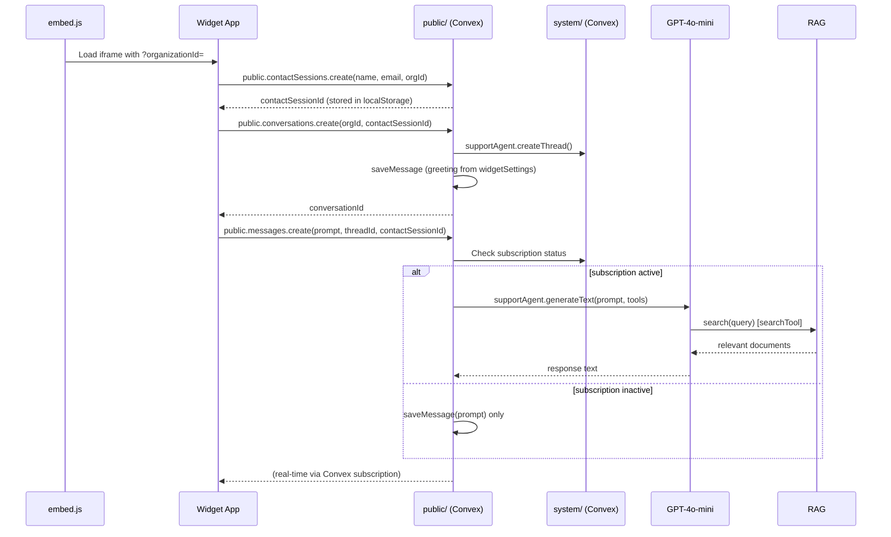
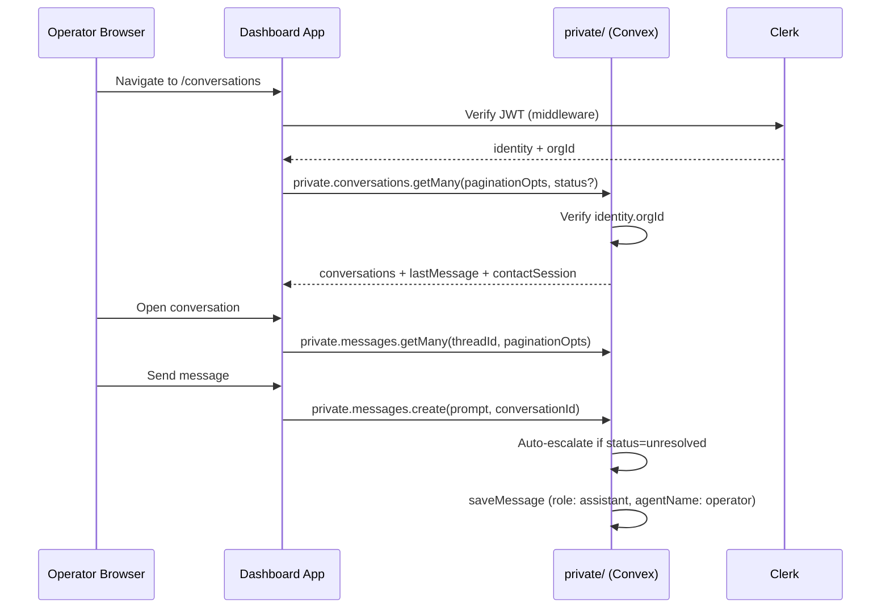
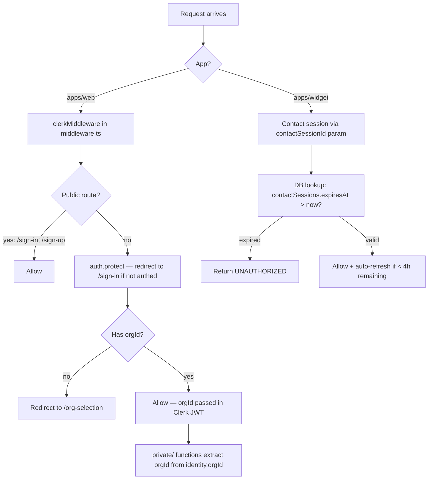

# Architecture

> See also: [development.md](./development.md) · [api.md](./api.md) · [deployment.md](./deployment.md)

---

## System Overview

Aivon is a multi-tenant AI customer support platform with three distinct user-facing applications backed by a shared Convex serverless backend.

```mermaid
graph TB
    subgraph Customer["Customer's Website"]
        ES[embed.js script<br/>apps/embed]
        IFR[iframe]
        ES -->|injects| IFR
    end

    subgraph Widget["apps/widget :3001"]
        WP[Next.js Widget App]
        IFR -->|loads via ?organizationId| WP
    end

    subgraph Dashboard["apps/web :3000"]
        DA[Next.js Dashboard App]
    end

    subgraph Backend["packages/backend — Convex Cloud"]
        direction TB
        PUB[public/ functions<br/>no auth]
        PRI[private/ functions<br/>Clerk JWT]
        SYS[system/ functions<br/>internal]
        DB[(Convex Database)]
        FS[(File Storage)]
        AGT[@convex-dev/agent<br/>GPT-4o-mini]
        RAG[@convex-dev/rag<br/>text-embedding-3-small]
        HTTP[HTTP Router<br/>/clerk-webhook]
    end

    subgraph External["External Services"]
        CLERK[Clerk Auth]
        OPENAI[OpenAI API]
        AWS[AWS Secrets Manager]
        VAPI[Vapi Voice AI]
        SENTRY[Sentry]
    end

    WP -->|Convex queries/mutations/actions| PUB
    DA -->|Convex queries/mutations/actions| PRI
    PUB --> SYS
    PRI --> SYS
    SYS --> DB
    SYS --> FS
    SYS --> AGT
    AGT --> RAG
    AGT -->|gpt-4o-mini| OPENAI
    RAG -->|text-embedding-3-small| OPENAI
    SYS -->|upsert/fetch secrets| AWS
    DA -->|OAuth/JWT| CLERK
    CLERK -->|webhook| HTTP
    HTTP --> SYS
    WP -->|voice calls| VAPI
    DA -->|error tracking| SENTRY
```

---

## Application Boundaries

| Application | Auth Model | Data Access | Users |
|-------------|-----------|-------------|-------|
| `apps/web` | Clerk JWT (org-scoped) | `private/` Convex functions | Human operators |
| `apps/widget` | Contact session (24h, DB-stored) | `public/` Convex functions | End-users / customers |
| `apps/embed` | None (static script) | None directly | Website owners (include the script) |

---

## Data Flow

### Widget Conversation Flow



### Operator Dashboard Flow



---

## Authentication / Authorization Flow



### Auth Layers

| Layer | Mechanism | Where enforced |
|-------|-----------|---------------|
| Dashboard auth | Clerk JWT (via `@clerk/nextjs`) | `apps/web/middleware.ts` |
| Dashboard org enforcement | `identity.orgId` check in every `private/` handler | `convex/private/*.ts` |
| Widget session auth | `contactSessionId` + expiry check | `convex/public/*.ts` |
| Convex ↔ Clerk trust | JWT issued by Clerk domain, verified by Convex | `convex/auth.config.ts` |
| Webhook verification | Svix signature validation | `convex/http.ts` |

---

## Database / Storage Architecture

### Tables (defined in `convex/schema.ts`)

| Table | Key Fields | Indexes |
|-------|-----------|---------|
| `subscriptions` | `organizationId`, `status` | `by_organization_id` |
| `widgetSettings` | `organizationId`, `greetMessage`, `defaultSuggestions`, `vapiSettings` | `by_organization_id` |
| `plugins` | `organizationId`, `service`, `secretName` | `by_organization_id`, `by_organization_id_and_service` |
| `conversations` | `threadId`, `organizationId`, `contactSessionId`, `status` | `by_organization_id`, `by_contact_session_id`, `by_thread_id`, `by_status_and_organization_id` |
| `contactSessions` | `name`, `email`, `organizationId`, `expiresAt`, `metadata` | `by_organization_id`, `by_expires_at` |
| `users` | `name` | (none — dev/test stub) |

**Agent/RAG tables** are managed by `@convex-dev/agent` and `@convex-dev/rag` components — they exist in the Convex instance but are not in `schema.ts`.

### File Storage
- Files are stored in **Convex File Storage** (`ctx.storage.store()`)
- Metadata and vector embeddings are managed by `@convex-dev/rag`
- Files are namespace-isolated per `organizationId`
- Content hash deduplication prevents re-indexing identical files

### Secret Storage
- API keys (e.g., Vapi) are stored in **AWS Secrets Manager**
- Key format: `tenant/{organizationId}/{service}`
- A pointer (`secretName`) is stored in the `plugins` table
- The actual secret value never enters the Convex database

---

## External Integrations

| Service | Purpose | Integration Point |
|---------|---------|------------------|
| **Clerk** | Auth, org management, billing webhooks | `middleware.ts`, `auth.config.ts`, `http.ts` |
| **OpenAI** | Chat (gpt-4o-mini), embeddings (text-embedding-3-small), vision/PDF extraction | `system/ai/agents/`, `system/ai/rag.ts`, `lib/extractTextContent.ts` |
| **AWS Secrets Manager** | Secure storage of third-party API keys | `lib/secrets.ts`, `system/secrets.ts` |
| **Vapi** | Voice AI assistant (voice calls in widget) | `private/vapi.ts`, `public/secrets.ts`, widget `use-vapi.ts` |
| **Sentry** | Error tracking and monitoring | `instrumentation.ts`, `instrumentation-client.ts`, `next.config.mjs` |
| **Svix** | Webhook signature verification (Clerk webhooks) | `http.ts` |

---

## Async / Background Processing

Convex has no traditional background job queue. Async work is handled via:

1. **Convex Actions**: Functions that can call external APIs (OpenAI, Vapi, AWS). Used for AI generation, file processing, and secret management.
2. **`ctx.scheduler.runAfter(0, ...)`**: Used in `private/secrets.ts` to dispatch secret upsert as an internal action without blocking the mutation.
3. **Real-time subscriptions**: Convex automatically pushes DB changes to subscribed clients. No polling needed for message updates.

---

## Important Dependencies

| Package | Version | Role |
|---------|---------|------|
| `convex` | 1.25.4 | Backend runtime and client |
| `@convex-dev/agent` | 0.1.16 | AI agent framework |
| `@convex-dev/rag` | 0.3.3 | RAG (retrieval-augmented generation) |
| `@clerk/nextjs` | ^6 | Auth for dashboard |
| `@clerk/backend` | ^2 | Server-side Clerk (webhook + org management) |
| `@ai-sdk/openai` | ^1 | OpenAI API client (Vercel AI SDK) |
| `@aws-sdk/client-secrets-manager` | ^3 | AWS secrets |
| `@vapi-ai/server-sdk` | ^0.10 | Vapi server API |
| `@vapi-ai/web` | ^2 | Vapi browser SDK (widget) |
| `next` | ^15 | React framework |
| `jotai` | ^2 | Client-side state management |
| `turbo` | ^2 | Monorepo build orchestration |
